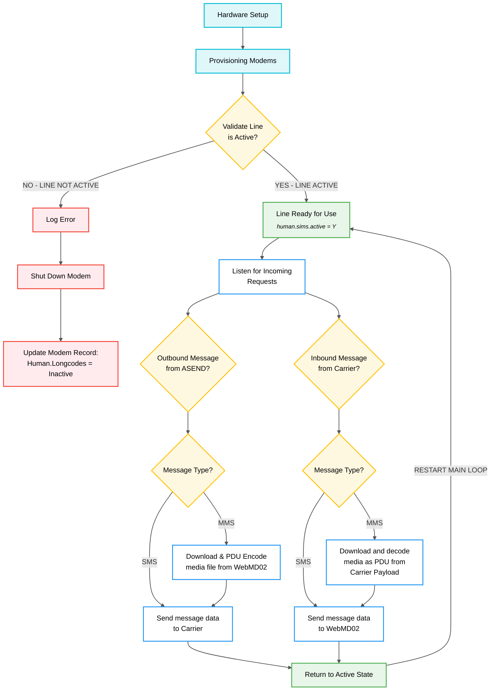

# ASE Modem Provisioning

### System, Hardware & Environment Data             
2x Hardware Sets - Raspberry PI & ProxMox VM's 

Raspberry Pi Capacity: 16 Modems

ProxMox VM's Capacity: 64 Modems


## Provisioning Process

<sub>
    <span style="color: orange;">
        <b>*Script Location:</b> Provisioning script in ~/SOFTWARE/utils/find_info.py
    </span>
</sub>

<br>

After setting up the hardware, the deck(server rack), and ensuring all modems are plugged into their correspondiing USB hub. After loading up a modem with a new sim, we must provision the sim card with the carrier. This ensures that a phone number is asigned to the sim card and thus the motem.  We can use the ICCID to view the state of the sim in the corresponding clients portal. If the carrier portal is showing that the sim is provisionied, you may need to wait for a cell tower to provision the assigned number to the sim cards memory address. 

### Provisioning Steps
1. When running the provisioning script:
   - You are prompted to push to SQL or not
   - Selecting "no" allows validation via dry run
   - Dry run reports issues like duplicate numbers to stdout

2. For duplicate phone numbers:
   - Likely caused by carrier not activating the line or deactivation
   - Navigate carrier portal to validate duplicate ICCIDs and identify active modem
   - Take ASE name of inactive modem, run `mmcli` with suffixed num as index
   - Run `mmcli -m {aseindex-1}` (mmcli indexes start at 0, ASE suffix index starts at 1)

3. After identifying deck, hub, and bus:
   - Swap SIM if needed
   - Reprovision if needed
   - Confirm no issues during provisioning

4. Conduct another dry run:
   - If no errors, execute live run
   - Discovered modem count should match hardware set capacity
   - If no issues and NOT a dry run, you'll be asked to update auth tokens
     - Only do this during fresh provisioning
     - With already-provisioned SIMs, this creates duplicate records

5. Update new records in Human.Longcodes to trigger the ASEND to update the Human.sims table:
    - After live run is succsesful, set the new modems to an active state
    - This will cause ASEND to pick them up, and update Human.sims

```SQL
UPDATE Human.longcodes SET ACTIVE ='Y' WHERE active ='N' and phoneSID like '%ASE{index}_ASE%';
```

> Note: If data appears to be stale after unplugging/modifying modems - restarting the ModemManager.service may solve this by recapturing the modems details

### Provisioning Output
- **CNUM**: Phone number associated with modem
- Also contains ICCID & IMEI
- Valid CNUM indicates successful phone number aqcusition 


<div style="text-align:center;">

## Process Flow


</div>